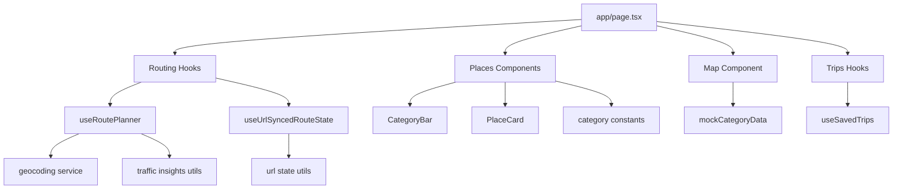

# RiyadhFlow Frontend

RiyadhFlow is a Next.js + TypeScript map experience focused on smart route planning inside Riyadh.  
This project demonstrates frontend architecture, map interactions, state synchronization, accessibility, testing, and CI quality gates.

## Highlights

- Hyper-glass UI with responsive desktop/mobile behavior
- Interactive Mapbox map with category-based place pins
- Multiple selectable route alternatives (Fastest/Balanced/Eco)
- Place details card with media, reviews, and one-click route intent
- URL-synced app state (`start`, `destination`, `category`) for shareable links
- Local trip persistence with `localStorage`
- Type-safe data modeling for categories and places
- Unit + component tests (Vitest + Testing Library)
- End-to-end user flow test (Playwright)
- Component-driven development with Storybook
- Lighthouse CI quality checks for performance/accessibility/best-practices
- Automated CI pipeline (lint, typecheck, tests, build, E2E, Storybook, Lighthouse)

## Architecture



## Project Structure

```text
app/
  components/
    Map.tsx
  features/
    places/
      components/
      constants/
    routing/
      hooks/
      services/
      utils/
    trips/
      hooks/
  utils/
    mockData.ts
```

## Quick Start

```bash
npm install
npm run dev
```

Open `http://localhost:3000`.

## Environment

Create `client/.env.local`:

```bash
NEXT_PUBLIC_MAPBOX_TOKEN=your_mapbox_public_token
```

If the token is missing, the UI still renders and displays a map fallback notice.

## Available Scripts

- `npm run dev` - Start local dev server
- `npm run lint` - Run Next.js + TypeScript lint rules
- `npm run typecheck` - Run TypeScript checks
- `npm run test:unit` - Run Vitest unit/component tests
- `npm run test:e2e` - Run Playwright E2E tests
- `npm run storybook` - Run Storybook locally
- `npm run build-storybook` - Build static Storybook
- `npm run lighthouse:ci` - Run Lighthouse CI checks
- `npm run build` - Production build
- `npm run start` - Run production server

## Testing

### Unit / Component

- Framework: Vitest
- Renderer: Testing Library
- Config: `vitest.config.ts`
- Coverage: enabled with V8 provider

### E2E

- Framework: Playwright
- Config: `playwright.config.ts`
- Includes a core flow test for:
  - filling route fields
  - saving a trip
  - category filter URL sync

## Storybook

- Framework: `@storybook/nextjs`
- Config: `.storybook/main.ts`
- Stories included for:
  - `CategoryBar`
  - `PlaceCard`
  - `RouteAlternativesPanel`

## Lighthouse CI

- Config: `.lighthouserc.json`
- Assertions include:
  - performance (warning threshold)
  - accessibility (error threshold)
  - best-practices (error threshold)
  - SEO (warning threshold)

## CI

GitHub Actions workflow: `.github/workflows/client-ci.yml`

Pipeline stages:

1. Lint
2. Typecheck
3. Unit tests
4. Build
5. E2E tests + Playwright artifact upload
6. Storybook build + artifact upload
7. Lighthouse CI + artifact upload

## Resume Talking Points

- Modular frontend architecture with domain-based feature slices
- URL-state synchronization for shareable, reproducible UX state
- Typed API/data boundaries and predictable state management
- Accessibility-first interactions (`aria`, keyboard marker support, focus-visible states)
- Production-grade quality workflow with automated tests + CI
